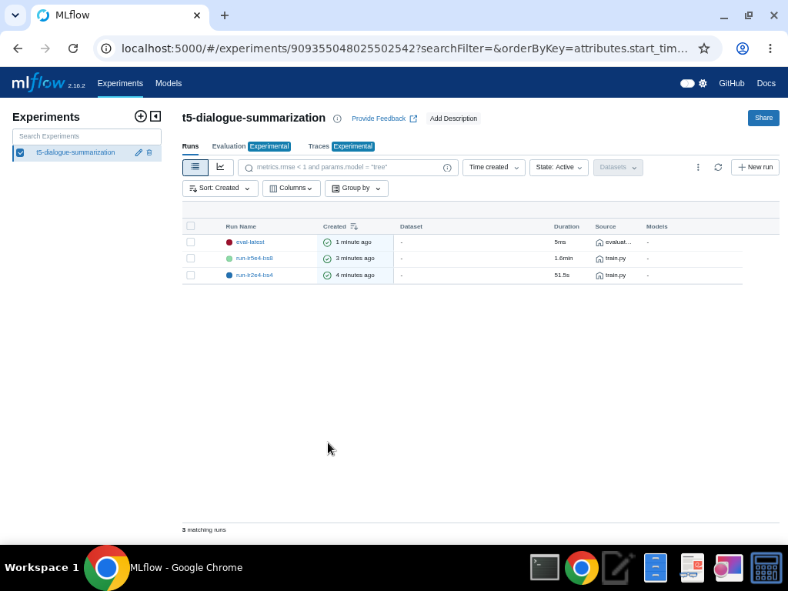
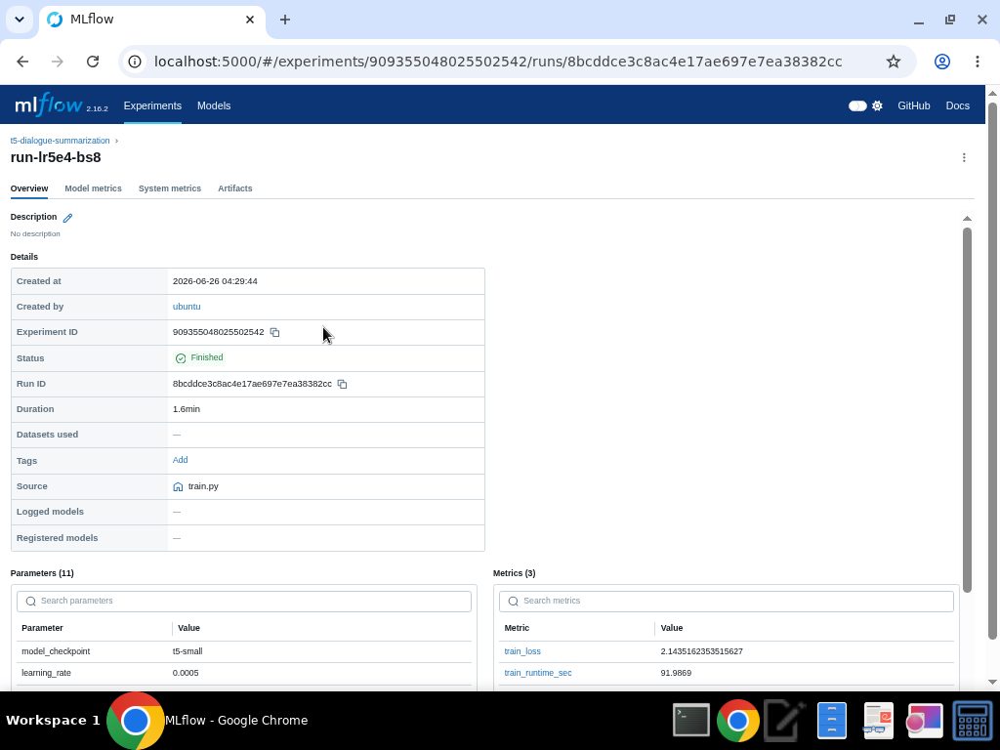
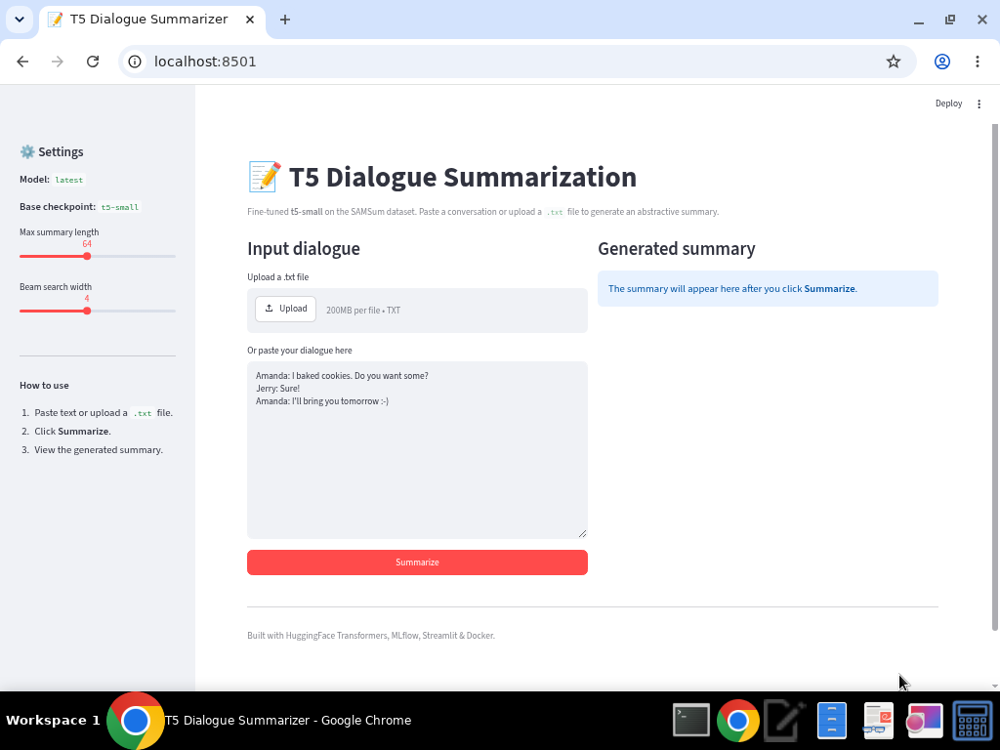
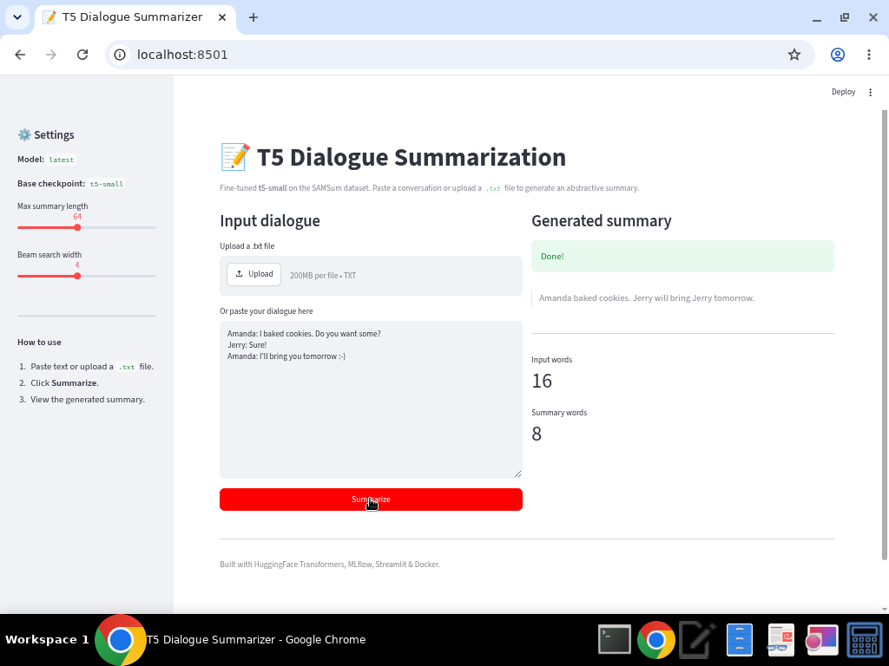

# 📝 T5 Dialogue Summarization

Fine-tuned **Transformer (T5)** model that produces concise, abstractive summaries of
multi-party chat dialogues, served through a **Dockerized Streamlit** prediction app and
tracked end-to-end with **MLflow**.

---

## 1. Project Overview

| | |
|---|---|
| **Domain** | Natural Language Processing — abstractive text summarization |
| **Problem** | Long chat conversations are time-consuming to read. We want a model that compresses a dialogue into a short, faithful summary. |
| **Approach** | Transfer-learn the pretrained `t5-small` encoder-decoder on the **SAMSum** messenger-style dialogue dataset. |
| **Expected output** | Given a dialogue (pasted or uploaded `.txt`), the app returns a 1–2 sentence summary. |
| **Serving** | Streamlit UI containerized with Docker (port `8501`). |

**Example**

```
Input:
  Amanda: I baked cookies. Do you want some?
  Jerry: Sure!
  Amanda: I'll bring you tomorrow :-)

Output:
  Amanda baked cookies. Jerry will bring Jerry tomorrow.
```

---

## 2. Repository Structure

```
final-project/
├── README.md               # This file
├── final_report.md         # Architecture / training / MLflow / Docker write-up
├── requirements.txt        # Pinned dependencies
├── .gitignore              # Ignores data/, models/, caches (NOT mlruns/)
├── Dockerfile              # Builds the Streamlit prediction app
├── src/
│   ├── data_download.py    # Auto-fetch SAMSum into data/
│   ├── data_utils.py       # Shared dataset loading & tokenization
│   ├── train.py            # Fine-tune T5 + MLflow tracking
│   ├── evaluate.py         # ROUGE evaluation on the test split
│   └── predict.py          # Inference function / CLI
├── app/
│   └── app.py              # Streamlit prediction UI (upload + paste)
├── configs/
│   └── config.yaml         # Central config (model, data, training, paths)
├── notebooks/
│   └── exploration.ipynb   # Original exploration notebook
├── mlruns/                 # MLflow experiment evidence (COMMITTED)
├── screenshots/            # MLflow / training / demo screenshots
├── models/                 # Trained models (git-ignored, regenerated)
├── artifacts/              # Evaluation report etc.
└── data/                   # Auto-downloaded dataset (git-ignored)
```

---

## 3. Setup

- **Python:** 3.11 (3.10+ works)
- **Install dependencies:**

```bash
python -m venv .venv && source .venv/bin/activate    # optional but recommended
pip install -r requirements.txt
```

---

## 4. Dataset & Data Fetching

- **Source:** [SAMSum](https://huggingface.co/datasets/knkarthick/samsum) — ~16k messenger-style
  dialogues with human-written summaries.
- **Why it fits:** SAMSum is purpose-built for abstractive dialogue summarization, exactly the
  target task. Summaries are short and third-person, ideal for `t5-small`.
- **No data is committed.** It is downloaded automatically into `data/` (git-ignored):

```bash
python src/data_download.py --config configs/config.yaml
```

The training and evaluation scripts also auto-download the data on first run if `data/` is empty.

---

## 5. Training

```bash
# Default config (t5-small, 1 epoch, max_steps=50, small subset)
python src/train.py --config configs/config.yaml

# Experiment 2 — different hyperparameters (HPO)
python src/train.py --config configs/config.yaml \
    --learning_rate 5e-4 --batch_size 8 --run_name run-lr5e4-bs8
```

**Important hyperparameters** (in `configs/config.yaml`, overridable from the CLI):

| Param | Meaning | Default |
|---|---|---|
| `model.checkpoint` | Pretrained base model (transfer learning) | `t5-small` |
| `training.learning_rate` | Optimizer step size | `2e-4` |
| `training.per_device_train_batch_size` | Batch size | `4` |
| `training.num_train_epochs` | Epochs | `1` |
| `training.max_steps` | Caps steps for fast runs (`-1` to disable) | `50` |
| `dataset.train_subset` | # training examples (0 = all) | `200` |
| `model.max_input_length` / `max_target_length` | Token limits | `256` / `64` |

> ⚙️ The defaults use the **smallest practical configuration** (t5-small, 1 epoch,
> `max_steps=50`, 200-example subset) so the whole pipeline runs in ~1 minute on CPU.
> Increase `train_subset`, `num_train_epochs` and remove `max_steps` for higher quality.

---

## 6. Evaluation

```bash
python src/evaluate.py --config configs/config.yaml
```

Computes **ROUGE-1 / ROUGE-2 / ROUGE-L** F1 on the SAMSum test split, logs them to MLflow,
and writes `artifacts/evaluation_report.txt`.

**Results from the included run** (50 test examples, minimal config):

| Metric | F1 |
|---|---|
| ROUGE-1 | 0.3632 |
| ROUGE-2 | 0.1408 |
| ROUGE-L | 0.3059 |

ROUGE measures n-gram overlap between the generated and reference summaries
(ROUGE-1 = unigrams, ROUGE-2 = bigrams, ROUGE-L = longest common subsequence). These scores
are reasonable for a tiny model trained on a 200-example subset and improve substantially with
more data/epochs.

---

## 7. MLflow Experiment Tracking

Training logs **parameters, metrics, and the model artifact** to the local file store in
`mlruns/` (committed to the repo as required).

```bash
# Start the MLflow UI
mlflow ui --backend-store-uri mlruns --host 0.0.0.0 --port 5000
# open http://localhost:5000
```

**Logged for every run:** `learning_rate`, `batch_size`, `num_train_epochs`, `max_steps`,
`weight_decay`, subset sizes, token limits, seed → and metrics `train_loss`,
`train_runtime_sec`, `eval_loss`. The fine-tuned model is logged under the `model/` artifact path.

**Two tracked experiments (different hyperparameters):**

| Run | learning_rate | batch_size | eval_loss |
|---|---|---|---|
| `run-lr2e4-bs4` | 2e-4 | 4 | 1.9055 |
| `run-lr5e4-bs8` | 5e-4 | 8 | 1.8410 |





---

## 8. Dockerized Prediction App

The Streamlit app lets a user **paste a dialogue or upload a `.txt` file** and see the model's
summary, with adjustable summary length and beam width.

```bash
# Build the image
docker build -t t5-summarizer-app:1.0 .

# Run the container (maps container port 8501 to host 8501)
docker run -p 8501:8501 t5-summarizer-app:1.0
# open http://localhost:8501
```

> The image bundles the fine-tuned model in `models/`. If `models/` is empty (e.g. a fresh
> clone where you skipped training), the app gracefully falls back to the base `t5-small`
> checkpoint, and you can train first with `python src/train.py`.

**App running with a live prediction:**





### Run the app locally (without Docker)

```bash
streamlit run app/app.py
```

### Single-shot CLI inference

```bash
python src/predict.py --text "Amanda: I baked cookies. Jerry: Sure!"
python src/predict.py --input path/to/dialogue.txt
```

---

## 9. Techniques Used (and where)

| Technique | Where |
|---|---|
| **Transfer learning** | `src/train.py` — starts from pretrained `t5-small` |
| **Transformers (seq2seq)** | T5 encoder-decoder via `AutoModelForSeq2SeqLM` |
| **Data preprocessing / tokenization** | `src/data_utils.py` (`summarize:` prefix, padding/truncation, `-100` label masking) |
| **Hyperparameter tuning** | CLI overrides in `train.py` → two MLflow runs |
| **MLflow experiment tracking** | `src/train.py`, `src/evaluate.py`, `mlruns/` |
| **Model evaluation (ROUGE)** | `src/evaluate.py` |
| **Dockerization** | `Dockerfile` |
| **UI serving** | `app/app.py` (Streamlit) |
| **Reproducible structure / config mgmt** | `configs/config.yaml`, `requirements.txt`, `.gitignore` |

---

## 10. Reproduce From a Fresh Clone

```bash
git clone <your-repo-url>
cd final-project
pip install -r requirements.txt
python src/data_download.py --config configs/config.yaml   # fetch data
python src/train.py --config configs/config.yaml           # experiment 1
python src/train.py --config configs/config.yaml --learning_rate 5e-4 --batch_size 8 --run_name run-lr5e4-bs8   # experiment 2
python src/evaluate.py --config configs/config.yaml        # ROUGE
mlflow ui --backend-store-uri mlruns --port 5000           # inspect runs
streamlit run app/app.py                                   # or: docker build/run
```

---

## 11. Limitations & Future Improvements

**Limitations**
- Minimal config (t5-small, 1 epoch, 200-example subset, `max_steps=50`) for speed → modest ROUGE.
- CPU training; no mixed precision.
- Occasional repetition / minor hallucination typical of small summarizers (see the example,
  where "Jerry" is repeated).
- English-only; tuned for short messenger dialogues, not long documents.

**Future improvements**
- Train on the full dataset for more epochs; try `t5-base` / `flan-t5`.
- Add ROUGE-based `compute_metrics` during training and early stopping.
- Systematic HPO (Optuna) and learning-rate scheduling.
- Add beam-search/length tuning, deduplication (`no_repeat_ngram_size`).
- GPU training and quantized inference for faster serving.

---

## 12. Notes

- `mlruns/` **is intentionally committed** so reviewers can inspect experiment history.
- `data/` and `models/` are git-ignored and regenerated by the scripts above.
- See **`final_report.md`** for the architecture and design write-up.
